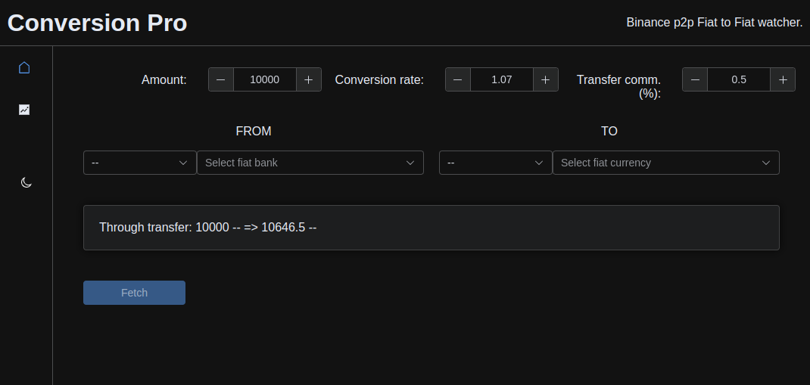
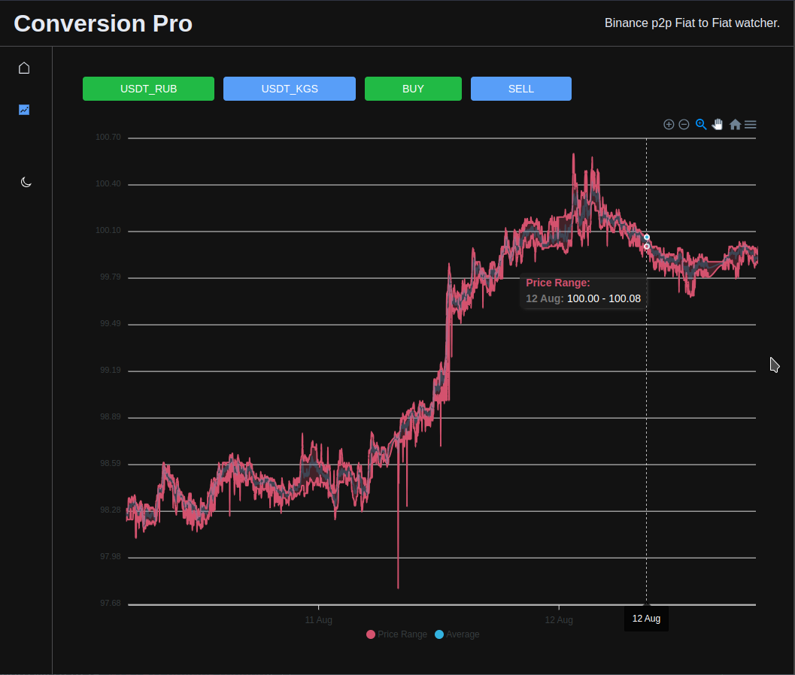

# Binance Conversion Pro

Simple tool to check the conversion rate between one Fiat currency to another in Binance P2P (C2C) and compare it with
the official/bank rate.



The main goal is to create watchers for pairs user interested in.

Also, as a proof of concept, the tool is collecting the data for `BUY` and `SELL` (only `min`/`max`/`avg` prices for
predefined banks from first page) orders for two pairs `USDT_RUB` and `USDT_KGS`.

Data collected every minute and stored in the SQLite database in `data` folder.

Collected data presented on the `Statistics` page in from of range chart:


## Project setup

```bash
pnpm install
```

### Compiles and hot-reloads for development

```bash
pnpm run dev
```

### Compiles and minifies for production

```bash
pnpm run build
```

## Docker

```shell
docker build --tag=conversion-pro .

docker run -d --rm -p "8080:8080" --volume ./data/:/app/data conversion-pro

```

## Kubernetes

You can run the app in Kubernetes cluster. There is `kube.example.yaml` file in the root of the project.

Don't forget to change the `<YOUR_HOST>`. And change `volume` path if needed.
